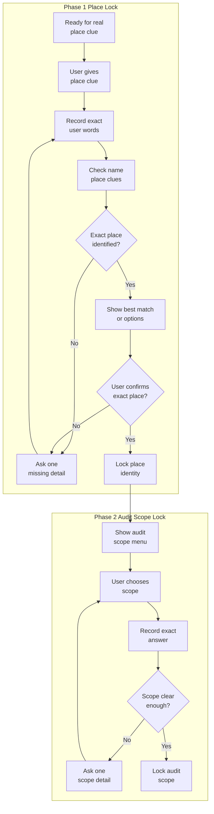

```mermaid
graph TD
  subgraph P1["Phase 1 Place Lock"]
    A["Ready for real<br/>place clue"]
    B["User gives<br/>place clue"]
    C["Record exact<br/>user words"]
    D["Check name<br/>place clues"]
    E{"Exact place<br/>identified?"}
    F["Ask one<br/>missing detail"]
    G["Show best match<br/>or options"]
    H{"User confirms<br/>exact place?"}
    I["Lock place<br/>identity"]
  end

  subgraph P2["Phase 2 Audit Scope Lock"]
    J["Show audit<br/>scope menu"]
    K["User chooses<br/>scope"]
    L["Record exact<br/>answer"]
    M{"Scope clear<br/>enough?"}
    N["Ask one<br/>scope detail"]
    O["Lock audit<br/>scope"]
  end

  A --> B --> C --> D --> E
  E -- No --> F --> C
  E -- Yes --> G --> H
  H -- No --> F
  H -- Yes --> I
  I --> J --> K --> L --> M
  M -- No --> N --> K
  M -- Yes --> O
```
