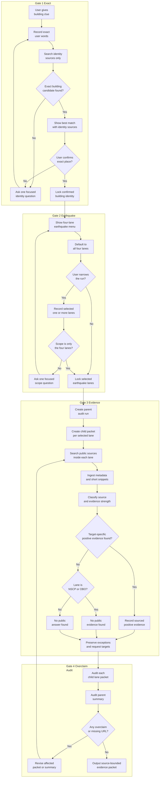

```mermaid
graph TD
  subgraph G1["Gate 1 Exact<br/>Building Identity"]
    A["User gives<br/>building clue"]
    B["Record exact<br/>user words"]
    C["Search identity<br/>sources only"]
    D{"Exact building<br/>candidate found?"}
    E["Ask one focused<br/>identity question"]
    F["Show best match<br/>with identity sources"]
    G{"User confirms<br/>exact place?"}
    H["Lock confirmed<br/>building identity"]
  end

  subgraph G2["Gate 2 Earthquake<br/>Lane Scope"]
    I["Show four-lane<br/>earthquake menu"]
    J["Default to<br/>all four lanes"]
    K{"User narrows<br/>the run?"}
    L["Record selected<br/>one or more lanes"]
    M{"Scope is only<br/>the four lanes?"}
    N["Ask one focused<br/>scope question"]
    O["Lock selected<br/>earthquake lanes"]
  end

  subgraph G3["Gate 3 Evidence<br/>Packet Build"]
    P["Create parent<br/>audit run"]
    Q["Create child packet<br/>per selected lane"]
    R["Search public sources<br/>inside each lane"]
    S["Ingest metadata<br/>and short snippets"]
    T["Classify source<br/>and evidence strength"]
    U{"Target-specific<br/>positive evidence found?"}
    V["Record sourced<br/>positive evidence"]
    W{"Lane is<br/>NSCP or OBO?"}
    X["No public<br/>evidence found"]
    Y["No public<br/>answer found"]
    Z["Preserve exceptions<br/>and request targets"]
  end

  subgraph G4["Gate 4 Overclaim<br/>Audit"]
    AA["Audit each<br/>child lane packet"]
    AB["Audit parent<br/>summary"]
    AC{"Any overclaim<br/>or missing URL?"}
    AD["Revise affected<br/>packet or summary"]
    AE["Output source-bounded<br/>evidence packet"]
  end

  A --> B --> C --> D
  D -- No --> E --> B
  D -- Yes --> F --> G
  G -- No --> E
  G -- Yes --> H
  H --> I --> J --> K
  K -- No --> O
  K -- Yes --> L --> M
  M -- No --> N --> I
  M -- Yes --> O
  O --> P --> Q --> R --> S --> T --> U
  U -- Yes --> V --> Z
  U -- No --> W
  W -- Yes --> X --> Z
  W -- No --> Y --> Z
  Z --> AA --> AB --> AC
  AC -- Yes --> AD --> R
  AC -- No --> AE
```
