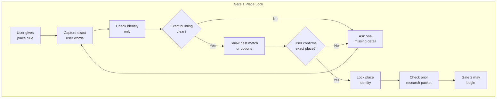

```mermaid
graph TD
  subgraph G1["Gate 1 Place Lock"]
    A["User gives<br/>place clue"]
    B["Capture exact<br/>user words"]
    C["Check identity<br/>only"]
    D{"Exact building<br/>clear?"}
    E["Ask one<br/>missing detail"]
    F["Show best match<br/>or options"]
    G{"User confirms<br/>exact place?"}
    H["Lock place<br/>identity"]
    I["Check prior<br/>research packet"]
    J["Gate 2 may<br/>begin"]
  end

  A --> B --> C --> D
  D -- No --> E --> B
  D -- Yes --> F --> G
  G -- No --> E
  G -- Yes --> H --> I --> J
```
