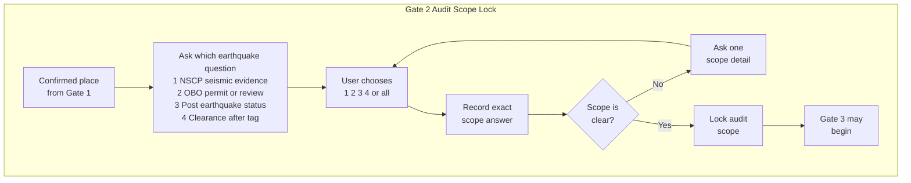

```mermaid
graph TD
  subgraph G2["Gate 2 Audit Scope Lock"]
    A["Confirmed place<br/>from Gate 1"]
    B["Ask which earthquake question<br/>1 NSCP seismic evidence<br/>2 OBO permit or review<br/>3 Post earthquake status<br/>4 Clearance after tag"]
    C["User chooses<br/>1 2 3 4 or all"]
    D["Record exact<br/>scope answer"]
    E{"Scope is<br/>clear?"}
    F["Ask one<br/>scope detail"]
    G["Lock audit<br/>scope"]
    H["Gate 3 may<br/>begin"]
  end

  A --> B --> C --> D --> E
  E -- No --> F --> C
  E -- Yes --> G --> H
```
