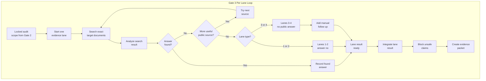

```mermaid
graph TD
  subgraph G3["Gate 3 Per Lane Loop"]
    A["Locked audit<br/>scope from Gate 2"]
    B["Start one<br/>evidence lane"]
    C["Search exact<br/>target documents"]
    D["Analyze search<br/>result"]
    E{"Answer<br/>found?"}
    F["Record found<br/>answer"]
    G{"More useful<br/>public source?"}
    H["Try next<br/>source"]
    I{"Lane type?"}
    J["Lanes 1-2<br/>answer no"]
    K["Lanes 3-4<br/>no public answer"]
    L["Add manual<br/>follow up"]
    M["Lane result<br/>ready"]
    N["Integrate lane<br/>result"]
    O["Block unsafe<br/>claims"]
    P["Create evidence<br/>packet"]
  end

  A --> B --> C --> D --> E
  E -- Yes --> F --> M
  E -- No --> G
  G -- Yes --> H --> C
  G -- No --> I
  I -- "1 or 2" --> J --> M
  I -- "3 or 4" --> K --> L --> M
  M --> N --> O --> P
```
