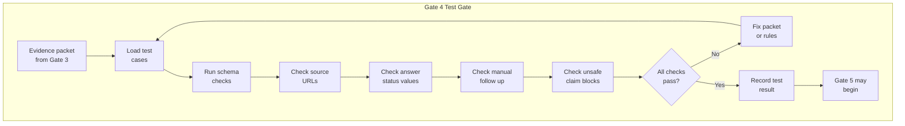

```mermaid
graph TD
  subgraph G4["Gate 4 Test Gate"]
    A["Evidence packet<br/>from Gate 3"]
    B["Load test<br/>cases"]
    C["Run schema<br/>checks"]
    D["Check source<br/>URLs"]
    E["Check answer<br/>status values"]
    F["Check manual<br/>follow up"]
    G["Check unsafe<br/>claim blocks"]
    H{"All checks<br/>pass?"}
    I["Fix packet<br/>or rules"]
    J["Record test<br/>result"]
    K["Gate 5 may<br/>begin"]
  end

  A --> B --> C --> D --> E --> F --> G --> H
  H -- No --> I --> B
  H -- Yes --> J --> K
```
